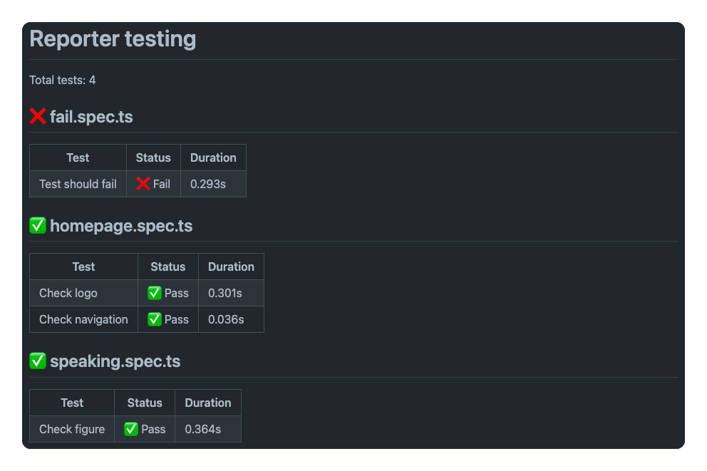
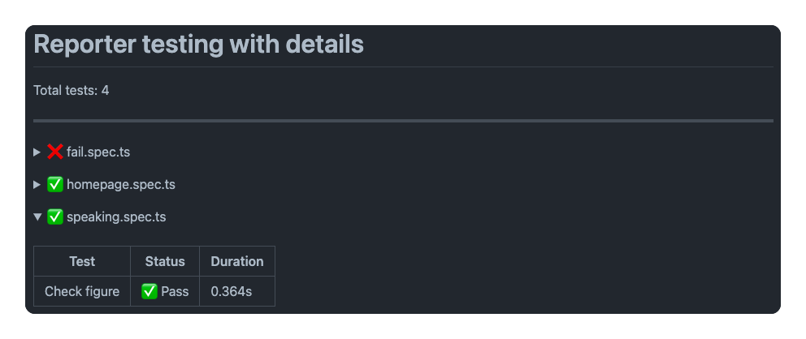
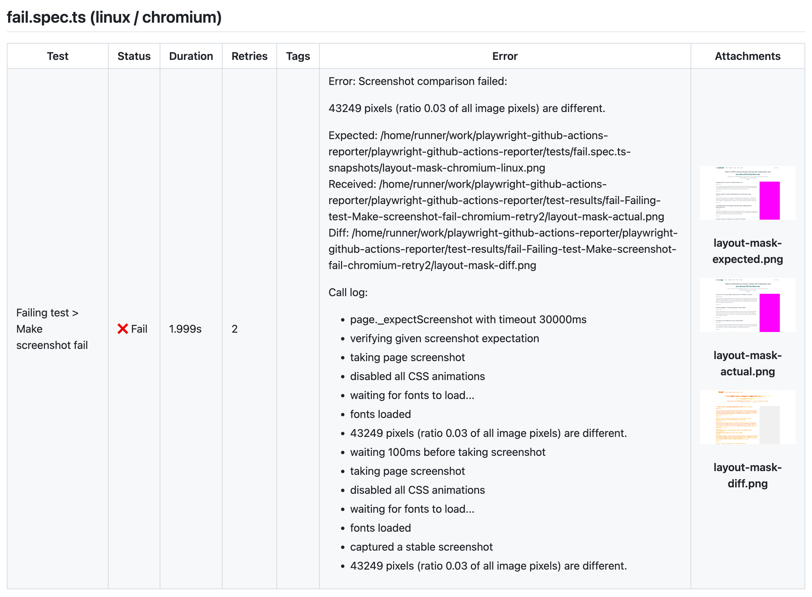

# GitHub Actions Reporter for Playwright

This action reports test results from Playwright to GitHub summaries.

## Installation

Install from npm:
  
```bash
npm install @estruyf/github-actions-reporter
```

## Usage

You can configure the reporter by adding it to the `playwright.config.js` file:

```ts
import { defineConfig } from '@playwright/test';

export default defineConfig({
  reporter: [
    ['list'],
    ['@estruyf/github-actions-reporter']
  ],
});
```

> More information on how to use reporters can be found in the [Playwright documentation](https://playwright.dev/docs/test-reporters).

## Configuration

The reporter supports the following configuration options:

| Option | Description | Default |
| --- | --- | --- |
| title | Title of the report. Use an empty string (`""`) to remove the heading.  | `Test results` |
| useDetails | Use details in summary which creates expandable content | `false` |
| showAnnotations | Show annotations from tests | `true` |
| showAnnotationsInColumn | Shows annotations from tests but in a column.  To enable showAnnotations must be set to `true` | `false` |
| showTags | Show tags from tests | `true` |
| showError | Show error message in summary | `false` |
| includeResults | Define which types of test results should be shown in the summary | `['pass', 'skipped', 'fail', 'flaky']` |
| quiet | Do not show any output in the console | `false` |
| showArtifactsLink | Show a link to the artifacts section in the workflow overview | `false` |
| azureStorageUrl | URL to the Azure Storage account where the screenshots are stored (optional) | `""` |
| azureStorageSAS | Shared Access Signature (SAS) token to access the Azure Storage account (optional) | `""` |

To use these option, you can update the reporter configuration:

```ts
import { defineConfig } from '@playwright/test';
import type { GitHubActionOptions } from '@estruyf/github-actions-reporter';

export default defineConfig({
  reporter: [
    ['@estruyf/github-actions-reporter', <GitHubActionOptions>{
      title: 'My custom title',
      useDetails: true,
      showError: true
    }]
  ],
});
```

### Example without details



### Example with details



## Showing result attachments

If you want to show attachments like when you use pixel matching, you need to provide the configuration for the blob service where the images will be stored.

> [!NOTE]
> GitHub does not have an API to link images to the summary. Therefore, you need to store the images in a blob storage service and provide the URL to the images.

> [!IMPORTANT]
> To show the attachments, you need to make sure to enable `showError` as well.



### Azure Blob Storage

If you are using Azure Blob Storage, you need to provide the `azureStorageUrl` and `azureStorageSAS` configuration options.

Follow the next steps to get the URL and SAS token:

- Go to your Azure Portal
- Navigate to your storage account or create a new one
- Navigate to **data storage** > **containers**
- Create a new container. Set the access level to **Blob (anonymous read access for blobs only)**
- Open the container, and click on **Shared access signature**
- Create a new shared access signature with the following settings:
  - Allowed permissions: **Create**
  - Expiry time: **Custom** (set the time you want)
  - Allowed protocols: **HTTPS only**
- Click on **Generate SAS and URL**
- Copy the **Blob SAS token**, this will be your `azureStorageSAS` value
- Copy the **Blob service URL** and append the container name to it, this will be your `azureStorageUrl` value. Example: `https://<name>.blob.core.windows.net/<container-name>`.
- Update the `playwright.config.js` file with the following configuration:

```ts
import { defineConfig } from '@playwright/test';

export default defineConfig({
  reporter: [
    ['@estruyf/github-actions-reporter', {
      showError: true,
      azureStorageUrl: 'https://<name>.blob.core.windows.net/<container-name>',
      azureStorageSAS: '<your-sas-token>'
    }]
  ],
});
```

[](https://visitorbadge.io/status?path=https%3A%2F%2Fgithub.com%2Festruyf%2Fplaywright-github-actions-reporter)
