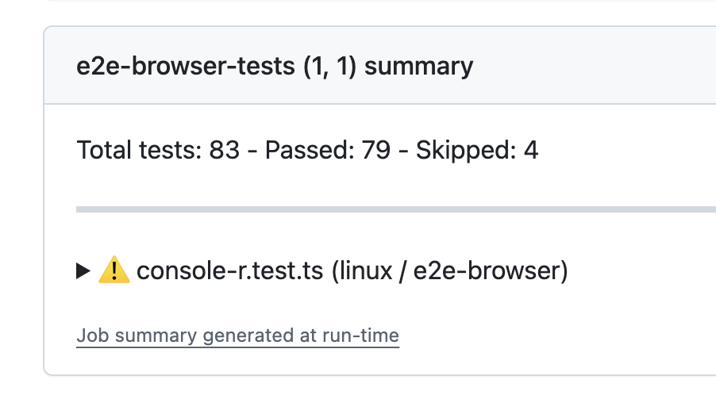
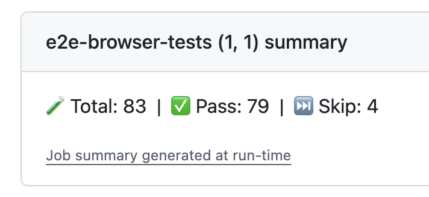

# GitHub Actions Reporter for Playwright

This action reports test results from Playwright to GitHub summaries.

This repository is a fork with enhancements focused on result formatting. Key differences include:

- Minimal Header: The header line has been removed for a cleaner look.
- Emoji Summary: Summaries now feature emojis for improved readability.

## Source repo



## This fork



## Installation

```bash
npm install @midleman/github-actions-reporter
yarn add @midleman/github-actions-reporter --dev
```

## Usage

You can configure the reporter by adding it to the `playwright.config.js` file:

```ts
import { defineConfig } from "@playwright/test";

export default defineConfig({
  reporter: [["list"], ["@midleman/github-actions-reporter"]],
});
```

> More information on how to use reporters can be found in the [Playwright documentation](https://playwright.dev/docs/test-reporters).

## Configuration

The reporter supports the following configuration options:

| Option          | Description                                                            | Default                                |
| --------------- | ---------------------------------------------------------------------- | -------------------------------------- |
| title           | Title of the report. Use an empty string (`""`) to remove the heading. | `Test results`                         |
| useDetails      | Use details in summary which creates expandable content                | `false`                                |
| showAnnotations | Show annotations from tests                                            | `true`                                 |
| showTags        | Show tags from tests                                                   | `true`                                 |
| showError       | Show error message in summary                                          | `false`                                |
| includeResults  | Define which types of test results should be shown in the summary      | `['pass', 'skipped', 'fail', 'flaky']` |
| quiet           | Do not show any output in the console                                  | `false`                                |

To use these option, you can update the reporter configuration:

```ts
import { defineConfig } from "@playwright/test";
import type { GitHubActionOptions } from "@estruyf/github-actions-reporter";

export default defineConfig({
  reporter: [
    [
      "@midleman/github-actions-reporter",
      <GitHubActionOptions>{
        title: "My custom title",
        useDetails: true,
        showError: true,
      },
    ],
  ],
});
```

### Example without details


### Example with details


[](https://visitorbadge.io/status?path=https%3A%2F%2Fgithub.com%2Festruyf%2Fplaywright-github-actions-reporter)
